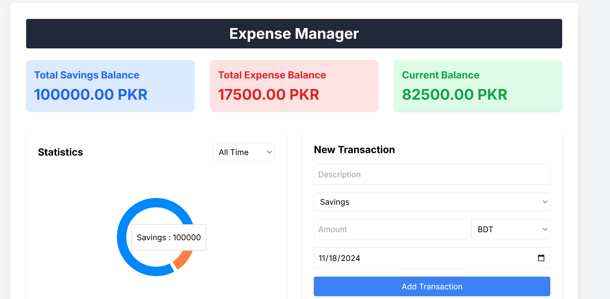
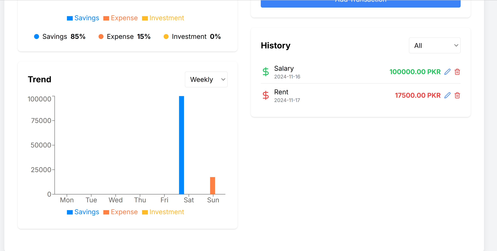

## Expense Manager

This is a simple expense manager application that allows users to track their expenses. The applications is built in React, tailwindcss and uses local storage to store the data. The application allows users to add, delete and edit expenses. The application also provides a summary of the expenses.

## Features

- Add expenses
- Delete expenses
- Edit expenses
- Summary of expenses
- Chart to show expenses
- Mobile responsive

## Installation

1. Clone the repository

```bash
git clone
```

2. Install the dependencies

```bash
npm install
```

3. Run the application

```bash
npm run dev
```

## Screenshots



